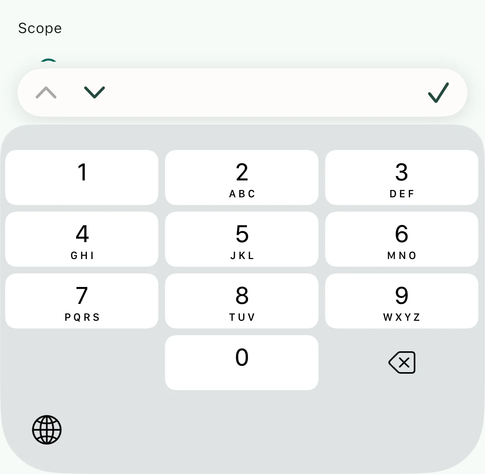
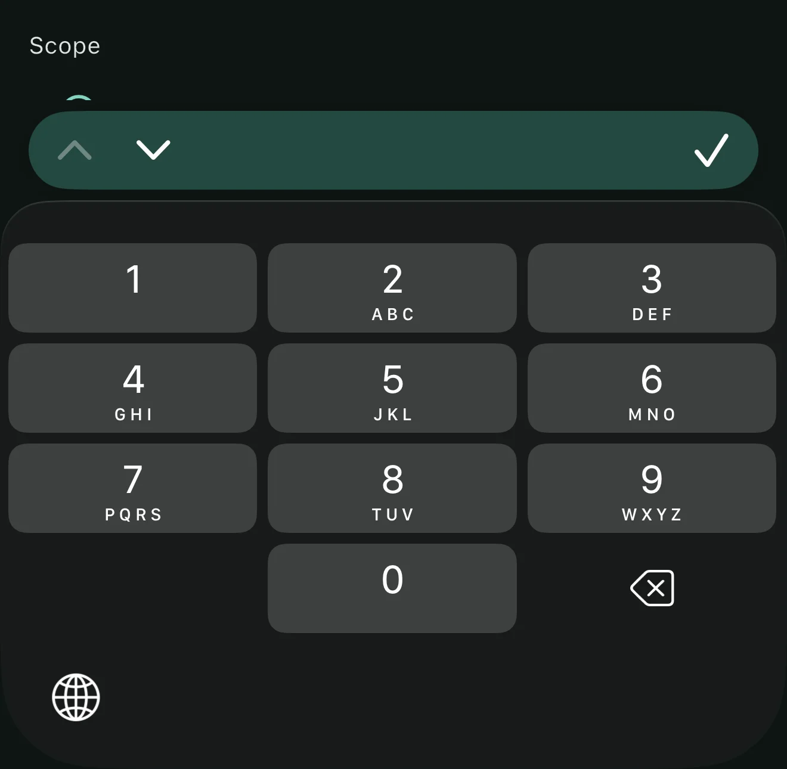
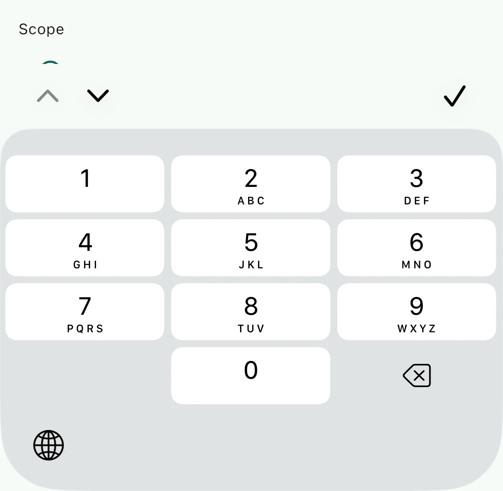
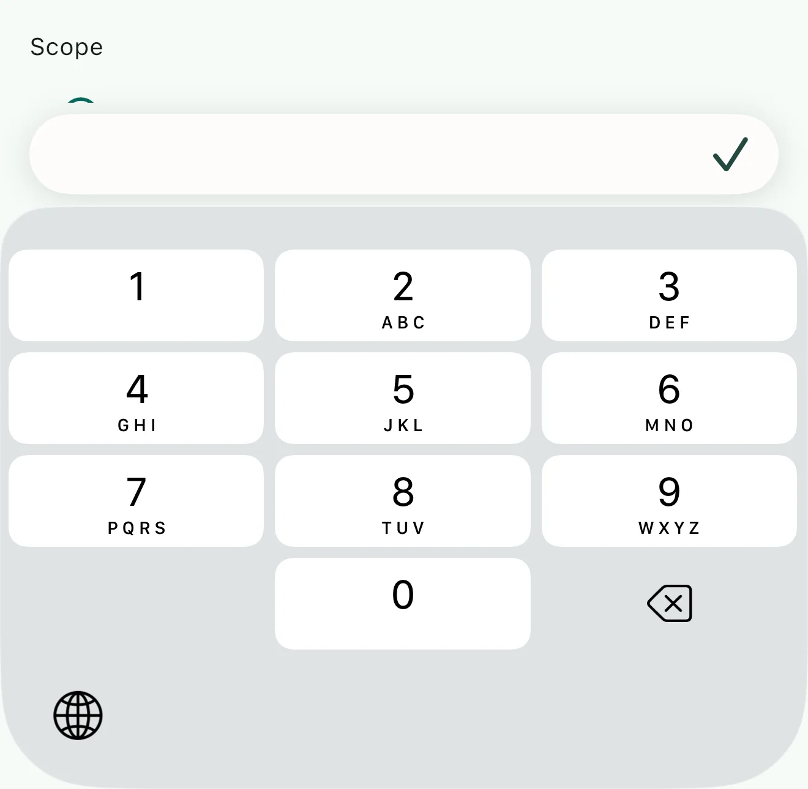

# native_keyboard_accessory

The native iOS keyboard accessory bar — previous / next / done above the
keyboard — for Flutter text fields.

Not a Flutter overlay. This attaches a real UIKit `inputAccessoryView`, so the
bar **is** part of the keyboard: it animates with it frame-for-frame, it is
included in the keyboard height iOS reports (so `MediaQuery.viewInsets.bottom`
already accounts for it and your content scrolls clear of it for free), and it
cannot tear or lag behind the way a `Positioned` widget driven by view insets
does.

iOS only. Every method is a no-op elsewhere — Android's numeric keyboards
already include an IME action key, so there is no missing affordance to replace.

## Screenshots

| Light mode | Dark mode |
|---|---|
|  |  |

| Zero-config default style | `doneOnly` layout |
|---|---|
|  |  |

## Why you might need it

iOS renders number, decimal, phone, and ASCII-number pads with **no return key
at all**. There is no built-in way to dismiss them or move to the next field.
Multi-line fields have a return key, but it inserts a newline, so they have no
exit either. Both cases are why native apps show an accessory bar — and why
Flutter apps, which get no bar, tend to grow a hand-rolled "Done" pill per
screen.

## Install

```yaml
dependencies:
  native_keyboard_accessory: ^0.1.0
```

## Use

Call `install()` once during startup. There is no per-field API and nothing to
wrap your fields in.

```dart
import 'package:native_keyboard_accessory/native_keyboard_accessory.dart';

Future<void> main() async {
  WidgetsFlutterBinding.ensureInitialized();
  await NativeKeyboardAccessory.instance.install();
  runApp(const MyApp());
}
```

That's the whole integration. Every field whose keyboard has no way out now
shows the bar, and the buttons move focus.

## Which fields get the bar

`KeyboardAccessoryScope` is three independent switches, because they are three
different problems:

| Flag | Fields | Default | Why |
|---|---|---|---|
| `numericKeyboards` | number, decimal, phone, ASCII-number pads | **on** | No return key at all — the bar is the only way out |
| `multilineFields` | return key inserts a newline | **on** | Has a return key, but it cannot dismiss |
| `singleLineTextFields` | return key is Done / Next / Search | **off** | Already has the affordance; a bar duplicates it and costs 56pt |

Presets: `standard` (the defaults above), `numericOnly`, `all`, `none`.

```dart
await NativeKeyboardAccessory.instance.setScope(KeyboardAccessoryScope.all);
```

Scope changes apply immediately — including to the field that is focused right
now, not just the next one. `none` is a live kill switch requiring no rebuild.

Classification happens natively from the keyboard the field actually raises, not
from Dart's `TextInputType`. That matters: `TextInputType.numberWithOptions`
does not map every variant to the same iOS keyboard, and the native check stays
correct however the engine chooses to map it.

## Styling

```dart
await NativeKeyboardAccessory.instance.install(
  style: const KeyboardAccessoryStyle(
    backgroundColor: Color(0xFFFDFCFA),
    darkBackgroundColor: Color(0xFF234840),
    tintColor: Color(0xFF234840),
    darkTintColor: Color(0xFFFDFCFA),
    cornerRadius: 22,
    layout: KeyboardAccessoryLayout.navigationAndDone,
  ),
);
```

Light and dark values become one dynamic `UIColor`, resolved per trait
collection. Supply only the light value to pin a single appearance. Corners use
`kCACornerCurveContinuous` — the squircle curvature iOS uses, equivalent to a
`figma_squircle` smoothing of 1. `layout` also offers `doneOnly` (for fields
that are not part of a traversable form) and `navigationOnly`.

The bar lays out with leading/trailing anchors, so it mirrors itself in a
right-to-left locale with no extra work.

## Accessibility

The buttons are icon-only, so supply labels from whatever localization your app
already uses, and push new ones when the locale changes:

```dart
await NativeKeyboardAccessory.instance.setLabels(
  KeyboardAccessoryLabels(
    previous: context.l10n.previous,
    next: context.l10n.next,
    done: context.l10n.done,
  ),
);
```

The chevrons are disabled when there is nowhere to go, rather than left as dead
controls.

## Overriding what the buttons do

By default the buttons run focus traversal — `previousFocus()`, `nextFocus()`,
`unfocus()` on the primary focus node. Intercept it if you need to:

```dart
await NativeKeyboardAccessory.instance.install(
  onAction: (KeyboardAccessoryAction action) {
    if (action == KeyboardAccessoryAction.done) {
      submitForm();
      return true;  // consumed
    }
    return false;   // fall through to focus traversal
  },
);
```

Traversal deliberately runs in Dart. Resigning first responder natively would
move the keyboard without telling the framework, leaving Flutter still believing
the field is focused and liable to re-raise the keyboard.

## Engine coupling — read this before shipping

Flutter's framework has no accessory-view concept: `EditableText` never creates
a `UITextField`. What the engine *does* create is `FlutterTextInputView`, the
hidden `UIView` it makes first responder to drive the keyboard. That class is
where an accessory view has to come from, and it is engine-internal.

**This package adds `-inputAccessoryView` to `FlutterTextInputView` at
runtime.** There is no public API for this and no plugin hook. That is the
honest cost of a native bar, and it is worth knowing about before you depend on
it.

It is written to fail closed:

- The class is looked up by name and the patch is skipped entirely if it is
  absent — no crash, no exception.
- `-inputAccessoryView` is attached with `class_addMethod`, which affects
  `FlutterTextInputView` alone. Using `class_getInstanceMethod` plus
  `method_setImplementation` here would rewrite **`UIResponder`'s** method and
  put the bar above the keyboard for every responder in your app. The package
  never does that.
- The optional `-setKeyboardType:` hook is only installed if that class
  implements the method itself, checked with `class_copyMethodList`. Without the
  hook the bar still works.
- `install()` returns a `KeyboardAccessoryInstallResult` reporting exactly what
  attached, so you can detect an unsupported engine at runtime instead of
  wondering why no bar appeared:

```dart
final result = await NativeKeyboardAccessory.instance.install();
assert(result.isUsable, 'accessory bar unavailable: $result');
```

Verified against Flutter 3.47.0 (engine `5f77625673`), where `installed`,
`inputAccessoryPatched`, and `keyboardTypeHookInstalled` all came back true.
Versions below it, down to the declared floor of Flutter 3.27, are permitted
but unverified. There and on every release newer than 3.47.0, `isUsable` is
the canary.

## Limitations

- iOS only.
- Scope is chosen per keyboard type, not per widget. There is no
  `KeyboardAccessory(child: TextField(...))` opt-out for one field. Deciding
  natively is what keeps the bar flicker-free, because UIKit queries the
  accessory view synchronously as the field becomes first responder — before a
  Dart round trip could answer.
- Chevron enablement uses `FocusNode.traversalDescendants`, which is
  depth-first tree order rather than the active `FocusTraversalPolicy`'s order;
  the framework offers no way to ask a policy "is there a next node?" without
  moving focus. These agree for ordinary vertical field stacks. Where they
  diverge you may see a chevron enabled that turns out to be a no-op. The tap
  itself always goes through the real policy, so it never jumps somewhere wrong.
- `uninstall()` stops the bar from being returned but does not restore the
  original method implementations — that is not safe once another party may have
  patched the same method afterwards.

## License

MIT
